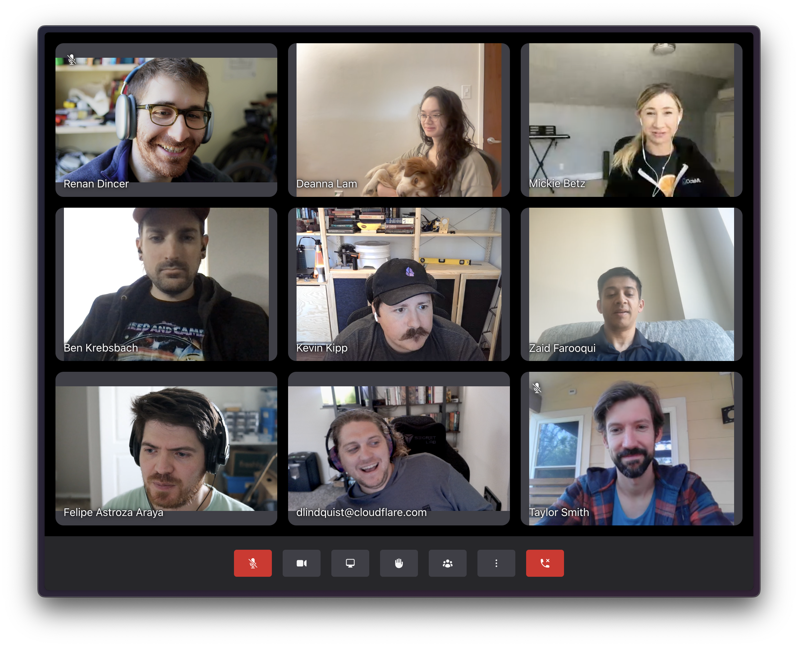
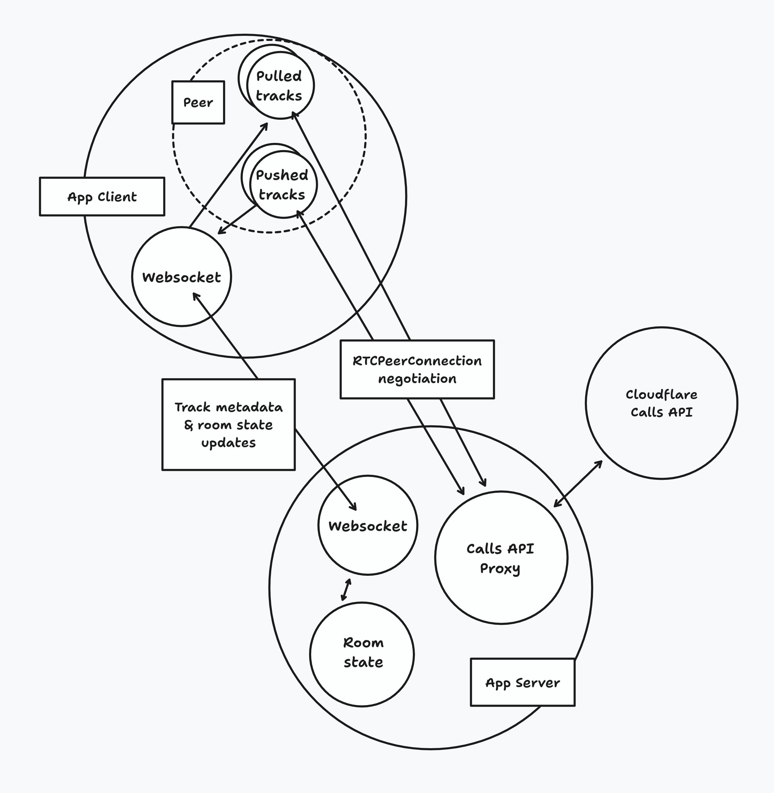

# Welcome to Orange Meets

Orange Meets is a demo application built using [Cloudflare Calls](https://developers.cloudflare.com/calls/).
To build your own WebRTC application using Cloudflare Calls, get started in the [Cloudflare Dashboard](https://dash.cloudflare.com/?to=/:account/calls).

[Try the demo here!](https://demo.orange.cloudflare.dev)



## Architecture Diagram



## Variables

Go to the [Cloudflare Calls dashboard](https://dash.cloudflare.com/?to=/:account/calls) and create an application.

Put these variables into `.dev.vars`

```
CALLS_APP_ID=<APP_ID_GOES_HERE>
CALLS_APP_SECRET=<SECRET_GOES_HERE>
```

### Optional variables

The following variables are optional:

- `MAX_WEBCAM_BITRATE` (default `1200000`): the maximum bitrate for each meeting participant's webcam.
- `MAX_WEBCAM_FRAMERATE` (default: `24`): the maximum number of frames per second for each meeting participant's webcam.
- `MAX_WEBCAM_QUALITY_LEVEL` (default `1080`): the maximum resolution for each meeting participant's webcam, based on the smallest dimension (i.e. the default is 1080p).

To customise these variables, place replacement values in `.dev.vars` (for development) and in the `[vars]` section of `wrangler.toml` (for the deployment).

## Development

```sh
npm run dev
```

Open up [http://127.0.0.1:8787](http://127.0.0.1:8787) and you should be ready to go!

## Deployment

1. Make sure you've installed `wrangler` and are logged in by running:

```sh
wrangler login
```

2. Update the `account_id` and `CALLS_APP_ID` in `wrangler.toml` to use your own Cloudflare Account ID and Calls App ID

3. You will also need to set the token as a secret by running:

```sh
wrangler secret put CALLS_APP_SECRET
```

4. Then you can run

```sh
npm run deploy
```
